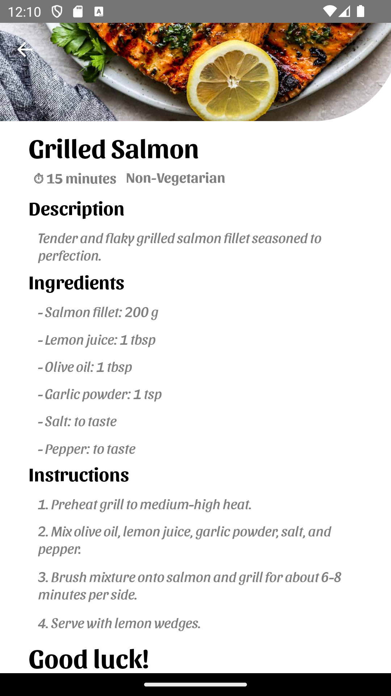

                                                               
# Flaveo                
Flaveo is an innovative recipe app designed to streamline meal planning and cooking. It offers a range of features that make it easy to discover, save, and track recipes while managing your grocery needs.

## Features
  - **Favorites:**  Easily access your favorite recipes in the "Fav" section.
  - **Saved Recipes:** View recipes saved for later use in the "Saved" section.
  - **Home Screen:** Explore food facts, browse by categories, and view popular dishes.
  - **Cart:** Add a recipe to your cart and see all its ingredients listed for shopping convenience.
  - **Discover:** Search for new recipes and track the ones you've tried.
    
## Technical Highlights
- **Static Data:** Currently, the app uses static data for displaying recipes and content.
- **Navigation:** Implemented with Stack and Tab Navigation for seamless transitions between app screens.
- **State Management:** Utilized Redux Toolkit for effective global state management and to handle app data flow.
- **UI/UX Enhancements:** Integrated Lottie Animations for an engaging user experience. Animated views for smooth transitions and visual appeal.
- **Custom Components:** Developed custom buttons and reusable UI components.
- **Functional Programming:** Used JavaScript array methods like .filter() and .map() to display and manage data efficiently.
  
## Tech Stack
Framework: React Native

Programming Language: JavaScript (ES6+)

## Future Enhancements
- Integrating real-time API data to replace static data.
- Adding user authentication for personalized experiences.
- Implementing recipe reviews and ratings.

## Screenshots
 ### Intro Screen

 ### LoginIn Screen

 ### SignUp Screen
 
 
 ### Profile Screen
 
 
 ### Edit Profile Screen
 
 
 ### Home Screen
 
 
 ### Saved Screen
 
 
 ### Favorites Screen
 
 
 ### Cart Screen
 
 
 ### Discover Screen
    
 
 ### Meals List Screen
 
 
 ### Meals Screen
   
 
